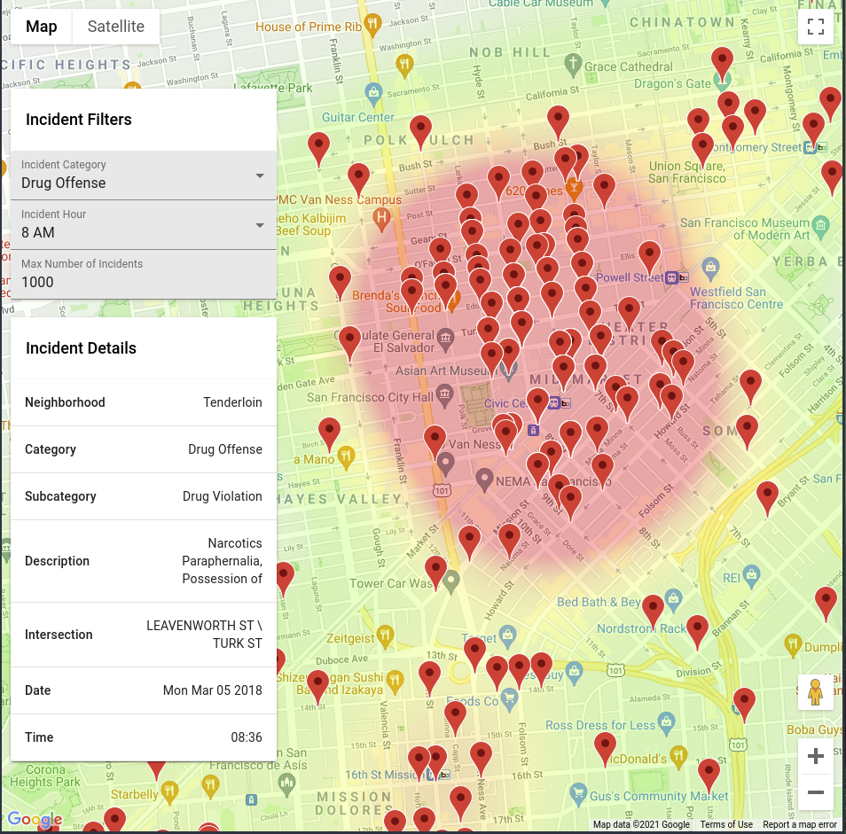

# Google Maps API demo



This project utilizes San Francisco crime data pulled from Open Socrata - [San Francisco Police Reports: 2018 to Present](https://dev.socrata.com/foundry/data.sfgov.org/wg3w-h783).

You can see a heatmap of crime data on top of San Francisco and filter by different crime categories and time of day. Additionally, you can click on crime markers and see
more information in an info window on the left side of the app.

## API Keys

To run this project, you will need to get api keys for both google maps and the San Francisco Data API:

Instructions for getting a google maps API key are here:

```
https://developers.google.com/maps/documentation/embed/get-api-key
```

The San Francisco Data API is here:
```
https://dev.socrata.com/foundry/data.sfgov.org/wg3w-h783
```

You will need to copy```src/config-template.ts``` to ```src/config.ts```. Then copy and paste the API keys into ```src/config.ts```.

## Available Scripts

In the project directory, you can run:

### `npm start`

Runs the app in the development mode.\
Open [http://localhost:3000](http://localhost:3000) to view it in the browser.

The page will reload if you make edits.\
You will also see any lint errors in the console.


### `npm run build`

Builds the app for production to the `build` folder.\
It correctly bundles React in production mode and optimizes the build for the best performance.

The build is minified and the filenames include the hashes.\
Your app is ready to be deployed!

See the section about [deployment](https://facebook.github.io/create-react-app/docs/deployment) for more information.

### TODOS

* Add Jest Tests
* Remove soda-js library as it is unnecessary and calling it is convoluted.
* Add history for selected incidents so use can go back and forwards through their history. 
* It would be interesting to see crime density relative to population density
